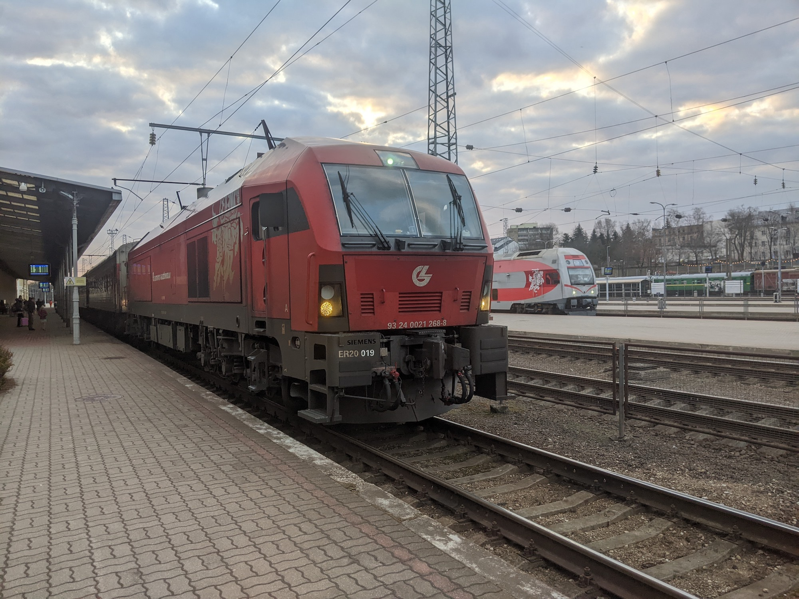

+++
title = 'Klaipeda'
date = 2023-06-17
draft = true
+++
On June 16 I went south to Lithuania for the second time to experience some semi-rare transit vehicles. Here’s a write-up of how it happened.
## Preface
There are a few important railway terms to understand before reading this post: locomotive, coach, and multiple unit.

A locomotive is a rail vehicle designed to provide motive power, i.e its sole purpose is to pull or push other vehicles. These vehicles may be freight wagons, passenger coaches or engineering equipment. A train may have a single locomotive or multiple. Modern locomotives are powered by either a diesel engine (or multiple) or electric power. These can either be configured in a “double-headed” formation (2 leading locomotives) or a “top-and-tail” configuration (one at the front, one at the back).

A passenger coach should be simple enough to understand: it’s a rail vehicle designed for carrying passengers. Coaches cannot provide motive power, they need to be pulled or pushed by a locomotive, same as freight wagons. Coaches can be coupled together to make coach formations, which can be extended or shortened depending on passenger demand, and on some trains this reconfiguration takes place during the journey, for example on night trains with coaches from different origins being combined to form a single train to its final destination. Some passenger coaches have train controls and a driver’s cab at one end, which can be used to control a locomotive on the other end: these are known as “cab cars” or “driving van trailers”, and save the need to run a locomotive around from one end of the train to the other after a train has arrived at its destination. These trains are known as “push-pull formations”.
