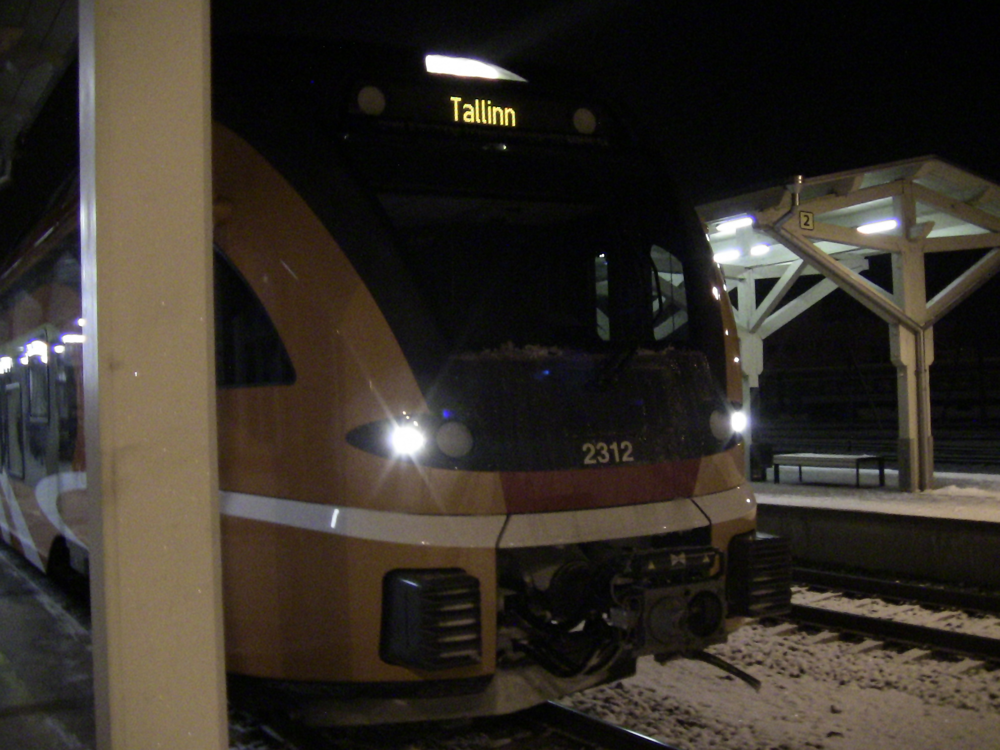

---
categories:
- Oldies
date: "2014-01-18T19:44:02Z"
title: 'Railway trip in Estonia: Sangaste-Tartu'
---

I have just completed my trip from Sangaste to Tartu in the new Stadler DEMU (diesel-electric multiple unit) successfully. The train was pretty good. My train was 2312, a 3-car unit (excluding the PowerPack in the middle). I will provide some pictures below.

A front view of the train in Tartu.

The name of the train: “Fellin”.

The unit number inside the train.

The old “Elektriraudtee” branding. On a train that has never been in service during “Elektriraudtee”‘s days (see post below for translation)!

The PID (Passenger Information Display) in the train.

The PID outside the train.

The door of Carriage C. The only door that has a ramp to bridge the gap between the train and the platform.

That’s it. What do you think?